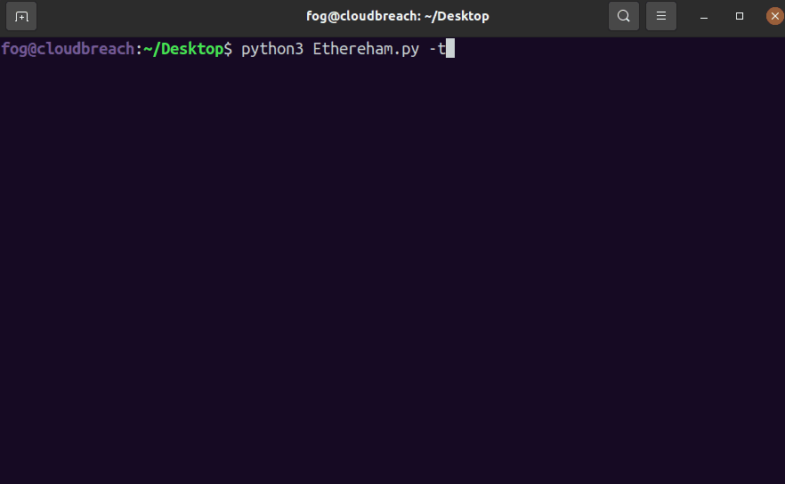

# Ethereham
Like a Ham radio for Ethereum, tune in to a specific address to see encoded messages in input data. This is a script for tracking and decoding input data messages sent to and from a particular Ethereum address or from every transaction in a block.


## Quick Start
Install the requirements

```pip install -r requirements.txt```

Infura provides a service for interacting with the Ethereum blockchain via API. You can sign up for a free Infura account here: [Infura](https://infura.io/). Free accounts can submit up to 100,000 requests to their API per day. After creating an account, follow the instructions [here](https://ethereumico.io/knowledge-base/infura-api-key-guide/) to generate an API key. Export the Infura API key as an environment variable.

```export WEB3_INFURA_PROJECT_ID="<infura API key>"```

### Basic Usage
Scan transactions and extract input data for Ethereum account 0xC8a65Fadf0e0dDAf421F28FEAb69Bf6E2E589963 starting at block number 13004800
```
python3 Ethereham.py -a 0xC8a65Fadf0e0dDAf421F28FEAb69Bf6E2E589963 -b 13004800
```
Scan all transactions and extract input data starting at the latest block number
```
python3 Ethereham.py -l -t
```



### Options
```
-b, --startingblock         The starting block number to begin scanning transactions from
-a, --ethereumaddress       Specific Ethereum address to monitor transactions for and decode input data from
-l, --startfromlatest       Begin scanning transactions from the latest block (overrides --startingblock)
-t, --scanalltransactions   Instead of monitoring a single address this flag will make Ethereham scan all transactions

```

## Credits
Thanks to Banteg for posting [this version](https://gist.github.com/banteg/bc9a6d5594fac27fa1d9342421fa570d) of the hacker_chat monitoring script during the Poly Network hack. It was used as a basis for Ethereham.
